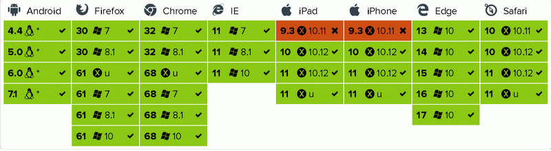

# RxxFetch

HTTP Fetch() 响应式接口，基于 [RxJS6](https://github.com/reactivex/rxjs) 封装，支持长青浏览器和 Node.js

[](https://www.npmjs.com/package/rxxfetch)
[](https://opensource.org/licenses/MIT)
[](https://travis-ci.org/waitingsong/rxxfetch)
[](https://ci.appveyor.com/project/waitingsong/rxxfetch/branch/master)
[](https://coveralls.io/github/waitingsong/rxxfetch?branch=master)

## 特点

- 响应式 ajax 编程
- 通过 `AbortController` 取消一个请求
- 支持浏览器和Node.js (需要 [node-fetch](https://www.npmjs.com/package/node-fetch) 垫片)
- 30x 重定向时可通过 keepRedirectCookies:true 参数提取并附加 cookies
- Restful API `GET` `POST` `PUT` `DELETE` via `get()` `post()` `put()` `remove()`
- 接口支持 `泛型`，例如 `get<string>(url).subscribe(txt => console.info(txt.slice(1)))`
- 支持 Node.js 以文本或者流的形式发送文件

## Browser support

[](https://saucelabs.com/u/waitingsong)
[]

- 长青浏览器基本不需要垫片
- IE11 需要这些垫片 [whatwg-fetch](https://github.com/github/fetch/), [es6-shim](https://github.com/paulmillr/es6-shim/), [es7-shim](http://github.com/es-shims/es7-shim/)
- Edge14 has 1 failed on [remove() with form data](https://github.com/waitingsong/rxxfetch/blob/master/test_browser/20_remove.test.ts#L106)
- Safari 11 (Mac OS X) has 1 failed on [abortController.abort()](https://github.com/waitingsong/rxxfetch/blob/master/test_browser/30_request.test.ts#L48) with `TypeError: Origin http://localhost:9876 is not allowed by Access-Control-Allow-Origin`
- Safari 11 (Mac OS X/iOS) may get failure on [abortController.abort()](https://github.com/waitingsong/rxxfetch/blob/master/test_browser/30_request.test.ts#L46)
 with `TypeError: Origin http://localhost:9876 is not allowed by Access-Control-Allow-Origin`
- Mobile Safari 10.0.0 (iOS 10.3.0) may get failure on [abortController.abort()](https://github.com/waitingsong/rxxfetch/blob/master/test_browser/30_request.test.ts#L46)
  with `TypeError: Type error`
- Mobile Safari 9.0.0 (iOS 9.3.0) may get failure on [redirect](https://github.com/waitingsong/rxxfetch/blob/master/test_browser/30_redirect.test.ts) 
 with `AssertionError: TypeError: Network request failed`
- Android 4.4 will get failure on [parseResponseType()](https://github.com/waitingsong/rxxfetch/blob/master/test_browser/30_response.test.ts#L160) 
 with `TypeError: Object function ArrayBuffer() { [native code] } has no method 'isView'`

## 安装

```bash
npm install rxxfetch
```

## 使用

### GET JSON

```ts
import { get, JsonType } from 'rxxfetch'

const url = 'https://httpbin.org/get'

get<HttpbinGetResponse>(url, args).subscribe(
  json => {
    console.log(json.url)
  },
  console.error,
)

/** GET Response Interface of httpbin.org */
export interface HttpbinGetResponse extends JsonType {
  args: any
  headers: {
    Accept: string
    Connection: string
    Host: string
    'User-Agent': string,
  }
  origin: string  // ip
  url: string
}
```

### GET HTML

```ts
import { get, RxRequestInit } from 'rxxfetch'

const url = 'https://httpbin.org/get'
const args: RxRequestInit = {
  dataType: 'text'
}

get<string>(url, args).subscribe(
  txt => {
    console.log(txt.slice(0, 10))
  },
  console.error,
)
```

### POST

```ts
import { post, RxRequestInit } from 'rxxfetch'

const url = 'https://httpbin.org/post'
const pdata = {
  p1: Math.random(),
  p2: Math.random().toString(),
}
const args: RxRequestInit = {
  data: pdata
}

post<HttpbinPostResponse>(url, args).subscribe(
  res => {
    const form = res.form
    assert(form && form.p1 === pdata.p1.toString(), `Should got "${pdata.p1}"`)
    assert(form && form.p2 === pdata.p2, `Should got "${pdata.p2}"`)
  },
)

/** POST Response Interface of httpbin.org */
export interface HttpbinPostResponse extends HttpbinGetResponse {
  data: string
  files: any
  form: any
  json: any
}
```

### `PUT` `REMOVE` goto [TEST](https://github.com/waitingsong/rxxfetch/tree/master/test_browser)

### On Node.js

- Needs some polylfill, details in [TEST](https://github.com/waitingsong/rxxfetch/blob/master/test/20_post.test.ts#L22)

  ```ts
  import nodefetch, { Headers } from 'node-fetch'

  const args = <RxRequestInit> {
    fetchModule: nodefetch,
    headersInitClass: Headers,
  }
  ```

- Node.js 下保留 302/303/307 重定向的 cookie 值，[CODE](https://github.com/waitingsong/rxxfetch/blob/master/test/30_cookie.test.ts)

  ```ts
  import nodefetch, { Headers } from 'node-fetch'

  const args = <RxRequestInit> {
    fetchModule: nodefetch,
    headersInitClass: Headers,
    keepRedirectCookies: true,  // <---- intercept redirect
  }
  ```

- 借助 `AbortController` 取消发出的请求, 详情见 [CODE](https://github.com/waitingsong/rxxfetch/blob/master/test/30_request.test.ts#L20)

  ```ts
  import { abortableFetch, AbortController } from 'abortcontroller-polyfill/dist/cjs-ponyfill.js'
  import nodefetch, { Headers } from 'node-fetch'

  const { fetch } = abortableFetch(nodefetch) // <-- polyfilling fetch
  const args = <RxRequestInit> {
    fetchModule: fetch,
    headersInitClass: Headers,
  }
  ```

- POST FILE
  - via `FormData`, goto [CODE](https://github.com/waitingsong/rxxfetch/blob/master/test/20_post.test.ts#L123)
  - via `Stream`, goto [CODE](https://github.com/waitingsong/rxxfetch/blob/master/test/20_post.test.ts#L158)

## Demos

- [Browser](https://github.com/waitingsong/rxxfetch/blob/master/test_browser/)
- [Node.js](https://github.com/waitingsong/rxxfetch/blob/master/test/)

## License

[MIT](LICENSE)

### Languages

- [English](README.md)
- [中文](README.zh-CN.md)
