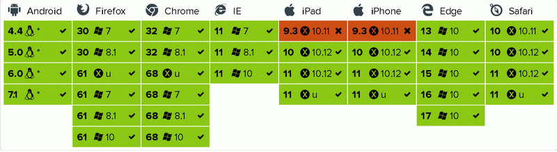

# [RxxFetch](https://waitingsong.github.io/rxxfetch/)

Observable HTTP Fetch() wrapped by [RxJS6](https://github.com/reactivex/rxjs), support browser and Node.js

[]()
[](https://opensource.org/licenses/MIT)

[](https://travis-ci.org/waitingsong/rxxfetch)
[](https://ci.appveyor.com/project/waitingsong/rxxfetch/branch/master)
[](https://coveralls.io/github/waitingsong/rxxfetch?branch=master)
[](https://conventionalcommits.org)
[](https://lernajs.io/)


## Features

- Reactive Ajax programming
- Request Cancelable via `AbortController`
- Runs in browsers and Node.js ([node-fetch](https://www.npmjs.com/package/node-fetch) polyfill though)
- Restful API `GET` `POST` `PUT` `DELETE` via `get()` `post()` `put()` `remove()`
- Retrieve and append cookies during 30x redirect on Node.js (via keepRedirectCookies:true)
- Apis support `Generics`, eg. `get<string>(url).subscribe(txt => console.info(txt.slice(1)))`
- Send file via `FormData` or `Stream` on Node.js

## Browser support

[](https://saucelabs.com/u/waitingsong)


- Should work fine without polyfills in every modern browser
- IE11 needs polyfills [whatwg-fetch](https://github.com/github/fetch/), [es6-shim](https://github.com/paulmillr/es6-shim/), [es7-shim](http://github.com/es-shims/es7-shim/)
- Edge14 has 1 failure on [remove() with form data](https://github.com/waitingsong/rxxfetch/blob/master/test_browser/20_remove.test.ts#L99)
- Safari 11 (Mac OS X/iOS) may get failure on [abortController.abort()](https://github.com/waitingsong/rxxfetch/blob/master/test_browser/30_abort.test.ts#L44)
 with `TypeError: Origin http://localhost:9876 is not allowed by Access-Control-Allow-Origin`
- Mobile Safari 10.0.0 (iOS 10.3.0) may get failure on [abortController.abort()](https://github.com/waitingsong/rxxfetch/blob/master/test_browser/30_abort.test.ts#L44)
  with `TypeError: Type error`
- Mobile Safari 9.0.0 (iOS 9.3.0) may get failure on [redirect](https://github.com/waitingsong/rxxfetch/blob/master/test_browser/30_redirect.test.ts) 
 with `AssertionError: TypeError: Network request failed`
- Android 4.4 will get failure on [parseResponseType()](https://github.com/waitingsong/rxxfetch/blob/master/test_browser/30_response.test.ts#L152) 
 with `TypeError: Object function ArrayBuffer() { [native code] } has no method 'isView'`

## Installing

```bash
npm install rxxfetch
```

## Usage

### GET JSON

```ts
import { get } from 'rxxfetch'

const url = 'https://httpbin.org/get'

get<HttpbinGetResponse>(url, args).subscribe(
  json => {
    console.log(json.url)
  },
  console.error,
)

/** GET Response Interface of httpbin.org */
export interface HttpbinGetResponse {
  args: any
  headers: {
    Accept: string
    Connection: string
    Host: string
    'User-Agent': string,
  }
  origin: string  // ip
  url: string
}
```

### GET HTML

```ts
import { get, RxRequestInit } from 'rxxfetch'

const url = 'https://httpbin.org/get'
const args: RxRequestInit = {
  dataType: 'text'
}

get<string>(url, args).subscribe(
  txt => {
    console.log(txt.slice(0, 10))
  },
  console.error,
)
```

### POST

```ts
import { post, RxRequestInit } from 'rxxfetch'

const url = 'https://httpbin.org/post'
const pdata = {
  p1: Math.random(),
  p2: Math.random().toString(),
}
const args: RxRequestInit = {
  data: pdata
}

post<HttpbinPostResponse>(url, args).subscribe(
  res => {
    const form = res.form
    assert(form && form.p1 === pdata.p1.toString(), `Should got "${pdata.p1}"`)
    assert(form && form.p2 === pdata.p2, `Should got "${pdata.p2}"`)
  },
)

/** POST Response Interface of httpbin.org */
export interface HttpbinPostResponse extends HttpbinGetResponse {
  data: string
  files: any
  form: any
  json: any
}
```

### `PUT` `REMOVE` goto [TEST](https://github.com/waitingsong/rxxfetch/tree/master/test_browser)

### On Node.js

- Handle cookies when 302/303/307 redirect on Node.js, [CODE](https://github.com/waitingsong/rxxfetch/blob/master/test/30_cookie.test.ts)

  ```ts
  const args = <RxRequestInit> {
    keepRedirectCookies: true,  // <---- intercept redirect -->
  }
  ```

- Cancel an request via `AbortController`, details in [CODE](https://github.com/waitingsong/rxxfetch/blob/master/test/30_abort.test.ts#L19)
- POST FILE
  - via `FormData`, goto [CODE](https://github.com/waitingsong/rxxfetch/blob/master/test/20_post.test.ts#L116)
  - via `Stream`, goto [CODE](https://github.com/waitingsong/rxxfetch/blob/master/test/20_post.test.ts#L151)

## Demos

- [Browser](https://github.com/waitingsong/rxxfetch/blob/master/test_browser/)
- [Node.js](https://github.com/waitingsong/rxxfetch/blob/master/test/)


## Packages

| Package       | Version                        | Dependencies                         | DevDependencies                        |
| ------------- | ------------------------------ | ------------------------------------ | -------------------------------------- |
| [`rxxfetch`]  | [![rxxfetch-svg]][rxxfetch-ch] | [![rxxfetch-d-svg]][rxxfetch-d-link] | [![rxxfetch-dd-svg]][rxxfetch-dd-link] |
| [`egg-fetch`] | [![egg-svg]][egg-ch]           | [![egg-d-svg]][egg-d-link]           | [![egg-dd-svg]][egg-dd-link]           |


## License

[MIT](LICENSE)

### Languages

- [English](README.md)
- [中文](README.zh-CN.md)


[`rxxfetch`]: https://github.com/waitingsong/rxxfetch/tree/master/packages/rxxfetch
[rxxfetch-svg]: https://img.shields.io/npm/v/rxxfetch.svg?maxAge=86400
[rxxfetch-ch]: https://github.com/waitingsong/rxxfetch/tree/master/packages/rxxfetch/CHANGELOG.md
[rxxfetch-d-svg]: https://david-dm.org/waitingsong/rxxfetch.svg?path=packages/rxxfetch
[rxxfetch-d-link]: https://david-dm.org/waitingsong/rxxfetch.svg?path=packages/rxxfetch
[rxxfetch-dd-svg]: https://david-dm.org/waitingsong/rxxfetch/dev-status.svg?path=packages/rxxfetch
[rxxfetch-dd-link]: https://david-dm.org/waitingsong/rxxfetch?path=packages/rxxfetch#info=devDependencies

[`egg-fetch`]: https://github.com/waitingsong/rxxfetch/tree/master/packages/egg-fetch
[egg-svg]: https://img.shields.io/npm/v/@waiting/egg-fetch.svg?maxAge=86400
[egg-ch]: https://github.com/waitingsong/rxxfetch/tree/master/packages/egg-fetch/CHANGELOG.md
[egg-d-svg]: https://david-dm.org/waitingsong/rxxfetch.svg?path=packages/egg-fetch
[egg-d-link]: https://david-dm.org/waitingsong/rxxfetch.svg?path=packages/egg-fetch
[egg-dd-svg]: https://david-dm.org/waitingsong/rxxfetch/dev-status.svg?path=packages/egg-fetch
[egg-dd-link]: https://david-dm.org/waitingsong/rxxfetch?path=packages/egg-fetch#info=devDependencies

